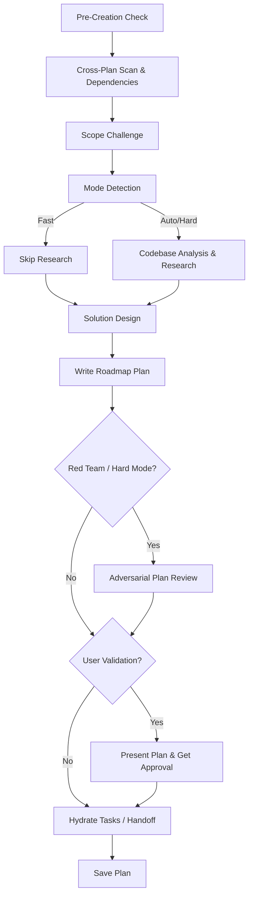

# Planning Skill

Create detailed technical implementation plans through research, codebase analysis, solution design, and comprehensive documentation.

This skill should be used when planning new feature implementations, architecting system designs, evaluating technical approaches, or breaking down complex requirements into technical roadmaps. It operates at a higher architectural level than the `implementation-planning` skill, which focuses on strict task-by-task execution.

**IMPORTANT:** Before you start, scan unfinished plans in the project at `src/apps/<module>/plans/`, `src/extensions/<ext>/plans/`, or `shared/api/engines/<engine>/plans/` to gather context. If there are relevant plans, update them as well to avoid duplication or conflicts.

## Pre-Creation Scan & Dependencies

Detect and mark blocking relationships between plans:

1. **Scan** — Read the frontmatter of each unfinished plan in the relevant module.
2. **Compare scope** — Check overlapping files, shared dependencies, same feature area.
3. **Classify relationship:**
   - New plan needs output of existing plan → new plan `blockedBy: [existing-plan-filename]`
   - New plan changes something existing plan depends on → existing plan `blockedBy: [new-plan-filename]`, new plan `blocks: [existing-plan-filename]`
   - Mutual dependency → both plans reference each other in `blockedBy`/`blocks`
4. **Bidirectional update** — When relationship detected, update BOTH plan files' frontmatter.
5. **Ambiguous?** → Ask the user with the header "Plan Dependency", present the overlap, and ask the user to confirm the relationship type.

### Plan Frontmatter Fields

```yaml
---
status: draft                            # draft, in-progress, blocked, ready, completed
blockedBy: [260301-1200-auth-system]     # This plan waits on these plans
blocks: [260228-0900-user-dashboard]     # This plan blocks these plans
---
```

**Status Interaction:** A plan with `blockedBy` entries where ANY blocker is not `completed` should note `blocked` in its status. When all blockers complete, it can be unblocked.

## Workflow Modes

When triggered, determine the planning mode based on task complexity (ask the user or auto-detect):

- **Fast:** Skip deep research phase. Use for straightforward, well-scoped requests.
- **Auto (Default):** Run standard research and codebase analysis before planning.
- **Hard / Red Team:** Run a strict adversarial review against your own plan before finalizing. Critically analyze for security risks, race conditions, edge cases, and maintainability.
- **Two Approaches:** Propose two distinct architectural approaches (with pros, cons, and tradeoffs) and have the user select one before writing the final plan.

## Process Flow



## Detailed Steps

### 1. Scope Challenge
Before designing, structurally challenge the scope. Does this feature make sense? Is it missing critical requirements? Are there simpler alternatives that achieve the business goal? Focus heavily on YAGNI (You Aren't Gonna Need It) and KISS (Keep It Simple, Stupid) principles.

### 2. Research & Codebase Analysis
Investigate the existing architecture.
- Identify which engines, modules, and extensions will be affected.
- Review existing documentation, `SPEC.md` if applicable, and similar features in the codebase.

### 3. Solution Design
Draft the technical architecture:
- Database schema changes (Sequelize models/migrations).
- API routes, controllers, services, and DTO validations.
- Event hooks, background workers, or websockets needed.
- Frontend components, views, and state management logic.

### 4. Red Team Review (Adversarial Review)
If the feature is complex (Hard mode), deliberately attack your own design:
- "What happens if external dependencies or caches go down?"
- "How does this logic handle concurrent requests?"
- "Is this vulnerable to IDOR or race conditions?"
- Revise the plan to proactively address discovered flaws.

### 5. Task Handoff & Organization
Once the high-level roadmap and system design are finalized and approved, save the plan file persistently.

Then, prompt the user: **"Architecture plan saved. Would you like me to use the `implementation-planning` skill to break this roadmap down into executable, test-driven bite-sized tasks?"**

## Quality Standards

- **DO NOT implement code** — only create plans in this skill.
- Thorough and specific, considering long-term maintainability.
- Address security and performance concerns preemptively.
- Be honest, be brutal, straight to the point, and concise in your communication.
- Fully respect the `xnapify` enterprise guidelines (proper error handling, DI registration, test-driven patterns, etc.).
