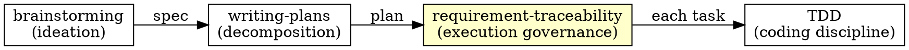
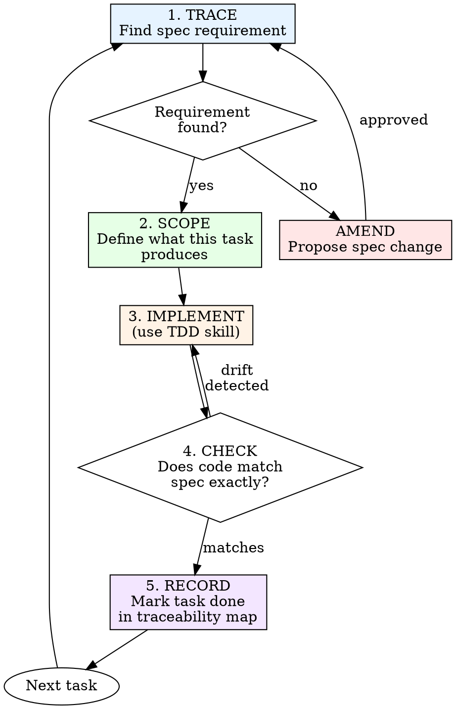

# Requirement Traceability

## Overview

The spec is the source of truth. Every line of code you write must trace back to a requirement in the spec. If the spec doesn't say to build it, don't. If the code doesn't match the spec, fix the code — or propose a spec amendment.

**Core principle:** Code without a spec requirement is unauthorized. A spec requirement without code is incomplete.

**This is not optional.** Requirement traceability is the execution discipline that connects design to implementation.

## When to Use

**Always when:**
- A design spec exists in `docs/specs/`
- An implementation plan exists in `docs/plans/`
- You're executing tasks from a plan
- You're modifying code that was built from a spec

**Exceptions (ask your human partner):**
- Hotfixes with no spec (write a retroactive spec after)
- Trivial config changes

## How Requirement Traceability Relates to Other Skills



| Skill | Governs |
|-------|---------|
| **brainstorming** | What to build, why, and how (design) |
| **writing-plans** | How to break it into bite-sized tasks |
| **requirement-traceability** | That each task traces to the spec, nothing is missed, nothing is added |
| **TDD** | That each piece of code has a failing test first |

**Requirement traceability wraps TDD.** When traceability says "implement this task," you use TDD to write it. Traceability ensures you implemented the *right* task from the *right* spec.

---

## The Iron Laws

```
1. NO CODE WITHOUT A SPEC REQUIREMENT
2. NO SPEC REQUIREMENT WITHOUT CODE
3. SPEC CHANGES GO THROUGH AMENDMENT PROCESS
```

---

## Pre-Flight: Loading the Spec

Before writing any code, load your context:

### Step 1: Locate the Spec and Plan

```bash
ls docs/specs/    # Find the design spec
ls docs/plans/    # Find the implementation plan
```

If either is missing, stop. You can't do requirement traceability without both.

### Step 2: Build the Traceability Map

Create a mental (or written) map connecting spec requirements → plan tasks → code files:

| Spec Requirement | Plan Task | Files | Status |
|-----------------|-----------|-------|--------|
| "Users can upload avatars" | Task 3: Upload endpoint | `api/controllers/avatar.controller.js` | ☐ |
| "Avatars resize to 200×200" | Task 4: Image processing | `api/workers/avatar.worker.js` | ☐ |
| "Invalid formats rejected" | Task 3: Upload endpoint | `validator/avatar.js` | ☐ |

For large specs, write this to a `task.md` artifact and track it as you go.

### Step 3: Identify Gaps Before Starting

Before writing any code:

| Check | Question |
|-------|----------|
| **Coverage** | Does every spec requirement have at least one plan task? |
| **Orphan tasks** | Does every plan task trace to a spec requirement? |
| **Missing plan tasks** | Are there spec requirements with no corresponding task? |
| **Scope creep** | Are there plan tasks that go beyond the spec? |

Found gaps? Fix the plan (or propose a spec amendment) before starting.

---

## Execution Loop

For each task in the plan:



### 1. TRACE — Find the Spec Requirement

Before touching code, answer:

> "Which requirement in the spec does this task fulfill?"

Point to the exact sentence or section. If you can't, this task shouldn't exist — it's scope creep.

### 2. SCOPE — Define the Boundaries

From the spec requirement, determine:

| Boundary | Question |
|----------|----------|
| **Inputs** | What data does this feature receive? |
| **Outputs** | What does it produce or change? |
| **Constraints** | What limitations does the spec define? |
| **Edge cases** | What error/boundary conditions does the spec mention? |
| **Not in scope** | What related things does the spec explicitly NOT include? |

> 🔴 **If the spec is silent on an edge case, do not invent behavior.** Ask your human partner or propose a spec amendment.

### 3. IMPLEMENT — Write Code (via TDD)

Use the `test-driven-development` skill. The test descriptions should reference spec requirements:

<Good>
```javascript
// Spec: "Avatars must be resized to 200×200 pixels"
test('resizes avatar to 200x200', async () => {
  const input = createImageBuffer(800, 600);
  const result = await resizeAvatar(input);
  expect(result.width).toBe(200);
  expect(result.height).toBe(200);
});
```
Tests trace directly to spec language
</Good>

<Bad>
```javascript
test('resize works', async () => {
  const result = await resizeAvatar(input);
  expect(result).toBeDefined();
});
```
Vague, doesn't prove spec compliance
</Bad>

### 4. CHECK — Verify Spec Compliance

After implementation, check:

| Check | Question |
|-------|----------|
| **Exact match** | Does the code behave exactly as the spec describes? |
| **No extras** | Did you add behavior the spec doesn't mention? |
| **No shortcuts** | Did you skip any constraint or edge case from the spec? |
| **Naming** | Do code names match spec terminology? |

### 5. RECORD — Update Traceability

Mark the task complete in your traceability map. Update `task.md`.

---

## Spec Drift Detection

**Spec drift** = when code and spec diverge during implementation.

### Common Causes

| Cause | Example | Response |
|-------|---------|----------|
| **Discovery** | "The spec says X, but that won't work because Y" | Propose amendment |
| **Gold-plating** | "While I'm here, let me also add Z" | Delete Z. It's not in the spec. |
| **Assumption** | "The spec doesn't mention error handling, so I'll decide" | Ask, don't assume |
| **Convenience** | "It's easier to implement it slightly differently" | Implement as spec says, or amend |

### The Amendment Process

When you discover the spec needs to change:

1. **Stop coding.** Don't implement the "better" version.
2. **Document the issue.** What does the spec say? Why doesn't it work?
3. **Propose the change.** What should the spec say instead?
4. **Get approval.** Present to your human partner.
5. **Update the spec.** Amend `docs/specs/YYYY-MM-DD-<topic>-design.md`.
6. **Update the plan.** If the plan needs to change, update `docs/plans/`.
7. **Resume implementation.** Now implement the amended spec.

```markdown
## Spec Amendment: [Topic]

**Current spec says:** "[exact quote]"
**Problem:** [why it doesn't work]
**Proposed change:** "[new wording]"
**Impact on plan:** [which tasks are affected]
```

> 🔴 **Never silently diverge from the spec.** Today's "obvious improvement" is tomorrow's "why doesn't this match the design doc?"

---

## Completion Checklist

Before marking a feature complete:

### Traceability Verification

- [ ] Every spec requirement has at least one test proving it works
- [ ] Every test references the spec requirement it validates
- [ ] No code exists without a spec requirement authorizing it
- [ ] No spec requirement exists without code implementing it

### Drift Check

- [ ] Re-read the spec top to bottom with fresh eyes
- [ ] Compare each spec requirement against actual behavior
- [ ] Amendments are documented and approved
- [ ] Plan reflects any spec amendments

### Quality Gates

- [ ] All tests pass (`npm test`)
- [ ] Lint passes (`npm run lint`)
- [ ] Code review (use `code-reviewer` skill)
- [ ] Spec + plan + code are in sync

Can't check all boxes? You have drift. Fix it.

---

## Common Rationalizations

| Excuse | Reality |
|--------|---------|
| "The spec didn't cover this edge case" | Ask or amend. Don't invent behavior. |
| "I improved the spec's approach" | Propose amendment. Don't silently diverge. |
| "It's just a small addition" | Small unauthorized additions compound into unmaintainable code. |
| "The spec is outdated" | Update the spec first, then update the code. |
| "Nobody reads the spec anyway" | The spec is the contract. Breaking the contract breaks trust. |
| "TDD is enough, I don't need traceability" | TDD ensures code works. Requirement traceability ensures you built the right thing. |
| "I'll update the spec later" | Later never comes. Amend now. |
| "The spec is too detailed/not detailed enough" | Give feedback to improve the brainstorming/planning process next time. |

---

## Retroactive Specs

Sometimes code exists without a spec (hotfixes, legacy code, exploratory prototypes).

### When This Happens

1. **Write a retroactive spec.** Document what was built and why.
2. **Save to** `docs/specs/YYYY-MM-DD-<topic>-design.md` with a `[RETROACTIVE]` tag.
3. **Create traceability.** Map existing code to the retroactive spec.
4. **Add missing tests.** Any spec requirement without a test gets one.

```markdown
# [Feature Name] Design Spec [RETROACTIVE]

> This spec was written after implementation to document existing behavior.
> Original implementation: [date/PR/commit]

**Purpose:** [What this feature does]
**Current behavior:** [How it works now]
**Known gaps:** [What's missing or inconsistent]
```

> Retroactive specs are second-best. Design-first specs are always preferred.

---

## Red Flags — STOP and Investigate

- Code with no spec requirement
- Spec requirement with no code
- Tests that don't reference spec language
- "While I'm here" additions
- Spec that hasn't been read in weeks
- Plan tasks that don't map to spec sections
- Silently changed behavior without spec amendment
- "The spec was wrong" without documented amendment

**All of these indicate spec drift. Fix before continuing.**

---

## Example: Implementing a Spec Requirement

**Spec says:** "Uploaded images must be validated: only JPEG, PNG, and WebP formats are accepted. Files larger than 5MB must be rejected with a 413 status code."

**TRACE:** Spec section 3.2, "Image Upload Constraints"

**SCOPE:**
- Inputs: multipart file upload
- Outputs: accepted (proceed) or rejected (413 / 400)
- Constraints: JPEG, PNG, WebP only; max 5MB
- Edge cases: empty file, wrong MIME type with correct extension
- Not in scope: image resizing (that's spec section 3.3)

**IMPLEMENT (via TDD):**

```javascript
// Spec 3.2: "only JPEG, PNG, and WebP formats are accepted"
test('accepts JPEG uploads', async () => {
  const res = await uploadImage(jpegBuffer, 'test.jpg');
  expect(res.status).toBe(200);
});

test('accepts PNG uploads', async () => {
  const res = await uploadImage(pngBuffer, 'test.png');
  expect(res.status).toBe(200);
});

test('accepts WebP uploads', async () => {
  const res = await uploadImage(webpBuffer, 'test.webp');
  expect(res.status).toBe(200);
});

test('rejects GIF uploads', async () => {
  const res = await uploadImage(gifBuffer, 'test.gif');
  expect(res.status).toBe(400);
});

// Spec 3.2: "Files larger than 5MB must be rejected with a 413 status code"
test('rejects files larger than 5MB with 413', async () => {
  const largeBuffer = Buffer.alloc(6 * 1024 * 1024);
  const res = await uploadImage(largeBuffer, 'large.jpg');
  expect(res.status).toBe(413);
});
```

**CHECK:** Does the code accept exactly JPEG/PNG/WebP? Does it reject with exactly 413 for oversized files? No extras? ✅

**RECORD:** Mark Task N complete. Update traceability map.

---

## Related Skills & Workflows

| Need | Skill / Workflow |
|------|-----------------|
| Design and requirements exploration | `brainstorming` skill |
| Breaking spec into implementation tasks | `writing-plans` skill |
| Coding discipline (test-first) | `test-driven-development` skill |
| Code quality review | `code-reviewer` skill |
| Coding standards | `clean-code` skill |
| Modify existing spec-driven code | `/update-code` workflow |
| Git workflow for commits | `/git-commit` workflow |
| Workspace isolation | `using-git-worktrees` skill |

## xnapify-Specific Notes

- **Spec location:** `docs/specs/YYYY-MM-DD-<topic>-design.md`
- **Plan location:** `docs/plans/YYYY-MM-DD-<topic>.md`
- **Always use `npm test`** — never `npx jest`. The `pretest` hook installs the SQLite driver.
- **File extension:** `.test.js` (not `.ts`) — the project uses JavaScript.
- **Amendments require human approval** — never amend a spec unilaterally.
