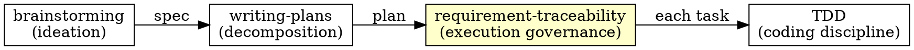
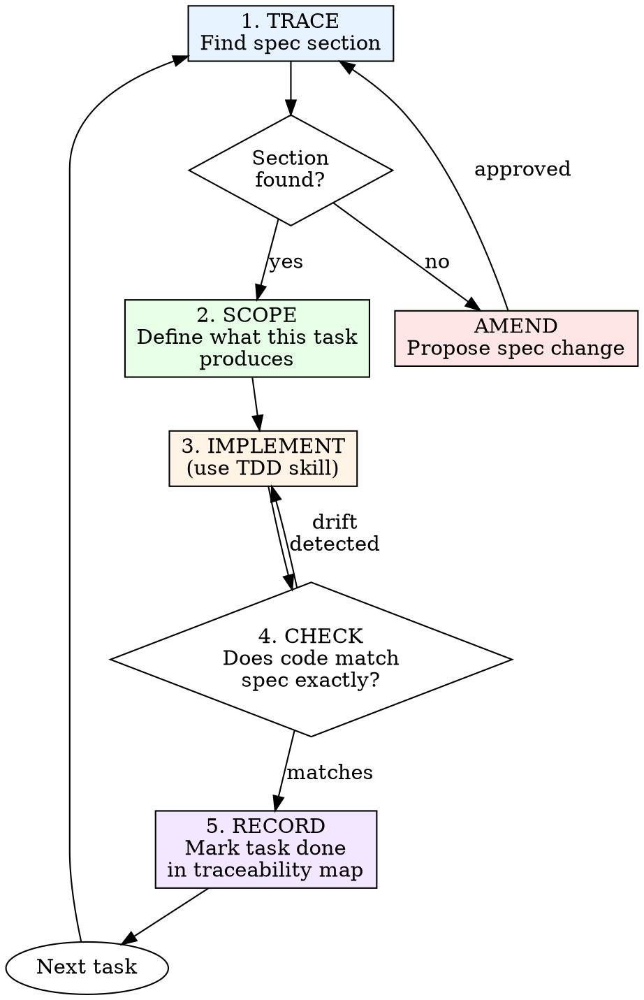

# Requirement Traceability

## Overview

The spec is the source of truth. Every line of code you write must trace back to a requirement in the spec. If the spec doesn't say to build it, don't. If the code doesn't match the spec, fix the code — or propose a spec amendment.

**Core principle:** Code without a spec requirement is unauthorized. A spec requirement without code is incomplete.

**This is not optional.** Requirement traceability is the execution discipline that connects design to implementation.

## When to Use

**Always when:**
- Modifying an existing module or engine that has a colocated `SPEC.md`
- Executing tasks from an implementation plan (created by `writing-plans` skill)
- Building a new feature from a design spec (created by `brainstorming` skill)

**Exceptions (ask your human partner):**
- Hotfixes with no spec (write a retroactive spec after)
- Trivial config changes

## How Requirement Traceability Relates to Other Skills



| Skill | Governs |
|-------|---------|
| **brainstorming** | What to build, why, and how (design) |
| **writing-plans** | How to break it into bite-sized tasks |
| **requirement-traceability** | That each task traces to the spec, nothing is missed, nothing is added |
| **TDD** | That each piece of code has a failing test first |

**Requirement traceability wraps TDD.** When traceability says "implement this task," you use TDD to write it. Traceability ensures you implemented the *right* task from the *right* spec.

---

## The Iron Laws

```
1. NO CODE WITHOUT A SPEC REQUIREMENT
2. NO SPEC REQUIREMENT WITHOUT CODE
3. SPEC CHANGES GO THROUGH AMENDMENT PROCESS
```

---

## Two-Tier Spec Model

xnapify has two types of specification documents. The traceability process applies to both:

### Tier 1: Colocated `SPEC.md` (Existing Code)

Every module, engine, shared library, and extension has a `SPEC.md` colocated in its root directory. These describe **current implementation** — what the code does today.

| Pattern | Example |
|---------|---------|
| `src/apps/<module>/SPEC.md` | `src/apps/auth/SPEC.md` |
| `shared/api/engines/<engine>/SPEC.md` | `shared/api/engines/db/SPEC.md` |
| `shared/<library>/SPEC.md` | `shared/container/SPEC.md` |
| `src/extensions/<ext>/SPEC.md` | `src/extensions/profile-plugin/SPEC.md` |
| `src/bootstrap/SPEC.md` | Bootstrap architecture |
| `src/SPEC.md` | Root application architecture |

**Template:** `.agent/templates/SPEC.template.md`

**Standard sections:**
1. Objective
2. Database Modifications (`api/models`)
3. API Routes & Controllers (`api/`)
4. Frontend SSR Rendering (`views/`)
5. Localization (`translations/`)
6. Container Services (optional)
7. Workers & Background Processing (optional)

**Use Tier 1 when:** Modifying existing modules, engines, or extensions.

### Tier 2: Design Specs (New Features)

For greenfield work, the `brainstorming` skill produces design specs and the `writing-plans` skill produces implementation plans — both saved **colocated** with the module:

```
src/apps/<module>/
├── SPEC.md                              # Current implementation (Tier 1)
├── specs/                               # Design specs (Tier 2)
│   └── YYYY-MM-DD-<topic>-design.md
├── plans/                               # Implementation plans
│   └── YYYY-MM-DD-<feature-name>.md
├── api/
└── views/
```

**Use Tier 2 when:** Building new features from scratch via the brainstorming → writing-plans pipeline.

### Which tier applies?

| Situation | Spec Source | Where |
|-----------|------------|-------|
| Modifying `src/apps/auth/` | Colocated SPEC.md | `src/apps/auth/SPEC.md` |
| Adding a feature to `shared/api/engines/db/` | Colocated SPEC.md | `shared/api/engines/db/SPEC.md` |
| Building a brand-new module from brainstorming | Design spec | `src/apps/<module>/specs/YYYY-MM-DD-*.md` |
| Implementing a plan from `writing-plans` | Plan + design spec | `src/apps/<module>/plans/YYYY-MM-DD-*.md` |

---

## Pre-Flight: Loading the Spec

Before writing any code, load your context:

### Step 1: Locate the Spec

**For existing modules/engines (Tier 1):**

```bash
cat src/apps/<module>/SPEC.md        # Module spec
cat shared/api/engines/<engine>/SPEC.md  # Engine spec
cat src/extensions/<ext>/SPEC.md     # Extension spec
```

Every module/engine has one. If it doesn't, create one from `.agent/templates/SPEC.template.md`.

**For new features (Tier 2):**

```bash
ls src/apps/<module>/specs/    # Find the design spec (from brainstorming)
ls src/apps/<module>/plans/    # Find the implementation plan (from writing-plans)
```

If neither exists and you're building something new, stop and use the `brainstorming` skill first.

### Step 2: Build the Traceability Map

Create a mental (or written) map connecting spec sections → code files:

**Tier 1 example (colocated SPEC.md):**

| SPEC.md Section | Code Files | Status |
|----------------|------------|--------|
| §2 API Routes: `POST /api/auth/login` | `api/controllers/auth.controller.js`, `api/routes/(default)/_route.js` | ☐ |
| §2 API Routes: `POST /api/auth/register` | `api/controllers/auth.controller.js` | ☐ |
| §1 Database: `User`, `UserLogin` | `api/models/User.js`, `api/models/UserLogin.js` | ☐ |

**Tier 2 example (design spec):**

| Design Spec Requirement | Plan Task | Files | Status |
|------------------------|-----------|-------|--------|
| "Users can upload avatars" | Task 3 | `api/controllers/avatar.controller.js` | ☐ |
| "Avatars resize to 200×200" | Task 4 | `api/workers/avatar.worker.js` | ☐ |

For large specs, write this to a `task.md` artifact and track it as you go. See `traceability-template.md` in this skill folder for a reusable template.

### Step 3: Identify Gaps Before Starting

Before writing any code:

| Check | Question |
|-------|----------|
| **Coverage** | Does every spec section/requirement have corresponding code? |
| **Orphan code** | Does every code file trace to a spec section? |
| **Missing sections** | Are there coded features not documented in the spec? |
| **Scope creep** | Are there plan tasks that go beyond the spec? |

Found gaps? Fix the spec (or propose an amendment) before starting.

---

## Execution Loop

For each task:



### 1. TRACE — Find the Spec Section

Before touching code, answer:

> "Which section in the SPEC.md does this task fulfill?"

For colocated specs, point to the exact section number (e.g., "§2 API Routes: `POST /api/auth/login`"). For design specs, point to the exact requirement sentence. If you can't trace the work to a spec section, this task shouldn't exist — it's scope creep.

### 2. SCOPE — Define the Boundaries

From the spec section, determine:

| Boundary | Question |
|----------|----------|
| **Inputs** | What data does this feature receive? |
| **Outputs** | What does it produce or change? |
| **Constraints** | What limitations does the spec define? |
| **Edge cases** | What error/boundary conditions does the spec mention? |
| **Not in scope** | What related things does the spec explicitly NOT include? |

> 🔴 **If the spec is silent on an edge case, do not invent behavior.** Ask your human partner or propose a spec amendment.

### 3. IMPLEMENT — Write Code (via TDD)

Use the `test-driven-development` skill. The test descriptions should reference spec sections:

<Good>
```javascript
// SPEC.md §2: "POST /api/auth/login validates credentials and sets HTTP-only JWT cookies"
test('login sets HTTP-only JWT cookie on valid credentials', async () => {
  const res = await request(app).post('/api/auth/login').send(validCreds);
  expect(res.status).toBe(200);
  expect(res.headers['set-cookie']).toMatch(/HttpOnly/);
});
```
Tests trace directly to SPEC.md section language
</Good>

<Bad>
```javascript
test('login works', async () => {
  const res = await request(app).post('/api/auth/login').send(validCreds);
  expect(res).toBeDefined();
});
```
Vague, doesn't prove spec compliance
</Bad>

### 4. CHECK — Verify Spec Compliance

After implementation, check:

| Check | Question |
|-------|----------|
| **Exact match** | Does the code behave exactly as the spec describes? |
| **No extras** | Did you add behavior the spec doesn't mention? |
| **No shortcuts** | Did you skip any constraint or edge case from the spec? |
| **Naming** | Do code names match spec terminology? |

### 5. RECORD — Update Traceability

Mark the task complete in your traceability map. Update `task.md`.

---

## Spec Drift Detection

**Spec drift** = when code and spec diverge during implementation.

### Common Causes

| Cause | Example | Response |
|-------|---------|----------|
| **Discovery** | "The spec says X, but that won't work because Y" | Propose amendment |
| **Gold-plating** | "While I'm here, let me also add Z" | Delete Z. It's not in the spec. |
| **Assumption** | "The spec doesn't mention error handling, so I'll decide" | Ask, don't assume |
| **Convenience** | "It's easier to implement it slightly differently" | Implement as spec says, or amend |
| **Stale spec** | "SPEC.md says column X, but code already uses column Y" | Update SPEC.md to match reality, then proceed |

### The Amendment Process

When you discover the spec needs to change:

1. **Stop coding.** Don't implement the "better" version.
2. **Document the issue.** What does the spec say? Why doesn't it work?
3. **Propose the change.** What should the spec say instead?
4. **Get approval.** Present to your human partner.
5. **Update the spec:**
   - **Colocated:** Edit the `SPEC.md` in the module/engine directory
   - **Design spec:** Edit the `<module>/specs/YYYY-MM-DD-<topic>-design.md` file
6. **Update the plan.** If a plan exists and needs to change, update it.
7. **Resume implementation.** Now implement the amended spec.

```markdown
## Spec Amendment: [Topic]

**Current spec says:** "[exact quote from SPEC.md §N]"
**Problem:** [why it doesn't work]
**Proposed change:** "[new wording]"
**Impact:** [which code files are affected]
```

> 🔴 **Never silently diverge from the spec.** Today's "obvious improvement" is tomorrow's "why doesn't this match the SPEC.md?"

---

## Keeping SPEC.md in Sync

Colocated `SPEC.md` files describe **current implementation**. This means they must be updated whenever the implementation changes.

### When to Update SPEC.md

| Action | Update Needed |
|--------|--------------|
| Adding a new API route to a module | Add to §2 of that module's SPEC.md |
| Adding a new model column | Add to §1 of that module's SPEC.md |
| Adding a new worker | Add to §6 of that module's SPEC.md |
| Changing controller behavior | Update §2 description |
| Adding a new frontend view | Update §3 |
| Adding translation keys | Update §4 |
| Major refactor | Full SPEC.md review |

### How to Update

1. Read the current SPEC.md
2. Identify which section your changes affect
3. Update the section to match your implementation
4. If the change is substantial, note it in a commit message

> 🔴 **Rule:** If you change code, change the SPEC.md. They must stay in sync.

---

## Completion Checklist

Before marking a feature complete:

### Traceability Verification

- [ ] Every spec section has corresponding code implementing it
- [ ] Every test references the spec section it validates
- [ ] No code exists without a spec section authorizing it
- [ ] No spec section exists without code implementing it

### Drift Check

- [ ] Re-read the SPEC.md (or design spec) with fresh eyes
- [ ] Compare each spec section against actual behavior
- [ ] Amendments are documented and approved
- [ ] SPEC.md reflects current implementation

### Quality Gates

- [ ] All tests pass (`npm test`)
- [ ] Lint passes (`npm run lint`)
- [ ] Code review (use `code-reviewer` skill)
- [ ] Spec and code are in sync

Can't check all boxes? You have drift. Fix it.

---

## Common Rationalizations

| Excuse | Reality |
|--------|---------|
| "The spec didn't cover this edge case" | Ask or amend. Don't invent behavior. |
| "I improved the spec's approach" | Propose amendment. Don't silently diverge. |
| "It's just a small addition" | Small unauthorized additions compound into unmaintainable code. |
| "The SPEC.md is outdated" | Update the SPEC.md first, then update the code. |
| "Nobody reads the SPEC.md anyway" | The SPEC.md is the contract. AI agents read it every time. |
| "TDD is enough, I don't need traceability" | TDD ensures code works. Requirement traceability ensures you built the right thing. |
| "I'll update the SPEC.md later" | Later never comes. Update now. |

---

## Retroactive Specs

Sometimes code exists without a SPEC.md (new modules, hotfixes, legacy code).

### When This Happens

1. **Create a SPEC.md.** Copy `.agent/templates/SPEC.template.md` to the module directory.
2. **Document current behavior.** Fill in each section based on what the code actually does.
3. **Add the note:** `*Note: This spec reflects the CURRENT implementation of {module}.*`
4. **Create traceability.** Map existing code to the new SPEC.md sections.
5. **Add missing tests.** Any spec section without a test gets one.

> Retroactive specs are second-best. Design-first specs are always preferred.

---

## Red Flags — STOP and Investigate

- Code with no SPEC.md section covering it
- SPEC.md section with no code implementing it
- Tests that don't reference spec language
- "While I'm here" additions
- SPEC.md that doesn't match current code
- Silently changed behavior without spec amendment
- "The spec was wrong" without documented amendment
- Module/engine with no SPEC.md at all

**All of these indicate spec drift. Fix before continuing.**

---

## Example: Modifying an Existing Module

**Task:** Add password reset endpoint to the auth module.

**TRACE:** Read `src/apps/auth/SPEC.md` → §2 API Routes. The spec mentions `POST /api/auth/refresh-token` but does NOT mention a password reset endpoint. This is a **new requirement**.

**AMEND:**
```markdown
## Spec Amendment: Password Reset

**Current SPEC.md §2 says:** Lists login, register, logout, OAuth, refresh-token, profile endpoints.
**Proposed addition:** Add `POST /api/auth/forgot-password` and `POST /api/auth/reset-password/:token`.
**Impact:** New controller methods, new model (`PasswordResetToken` — already listed in §1).
```

**After approval, update `src/apps/auth/SPEC.md` §2:**
```markdown
- **Method & Path:** `POST /api/auth/forgot-password`
  - **Logic:** Generates a time-limited reset token and sends reset email.
- **Method & Path:** `POST /api/auth/reset-password/:token`
  - **Logic:** Validates token, updates password, invalidates all existing sessions.
```

**IMPLEMENT (via TDD):**
```javascript
// SPEC.md §2: "Generates a time-limited reset token and sends reset email"
test('forgot-password generates token and sends email', async () => {
  const res = await request(app)
    .post('/api/auth/forgot-password')
    .send({ email: 'user@test.com' });
  expect(res.status).toBe(200);
  expect(emailMock).toHaveBeenCalledWith(
    expect.objectContaining({ to: 'user@test.com' })
  );
});
```

**CHECK:** Does the code match the amended spec exactly? ✅

**RECORD:** Mark complete. SPEC.md updated. Tests pass.

---

## Related Skills & Workflows

| Need | Skill / Workflow |
|------|-----------------|
| Design and requirements exploration | `brainstorming` skill |
| Breaking spec into implementation tasks | `writing-plans` skill |
| Coding discipline (test-first) | `test-driven-development` skill |
| Code quality review | `code-reviewer` skill |
| Coding standards | `clean-code` skill |
| Modify existing spec-driven code | `/update-code` workflow |
| Git workflow for commits | `/git-commit` workflow |
| Workspace isolation | `using-git-worktrees` skill |

## xnapify-Specific Notes

- **Colocated specs:** Every module/engine has a `SPEC.md` in its root directory
- **SPEC.md template:** `.agent/templates/SPEC.template.md`
- **Design specs (new features):** `<module>/specs/YYYY-MM-DD-<topic>-design.md` (created by `brainstorming`)
- **Plans:** `<module>/plans/YYYY-MM-DD-<feature-name>.md` (created by `writing-plans`)
- **Always use `npm test`** — never `npx jest`. The `pretest` hook installs the SQLite driver.
- **File extension:** `.test.js` (not `.ts`) — the project uses JavaScript.
- **Amendments require human approval** — never amend a spec unilaterally.
