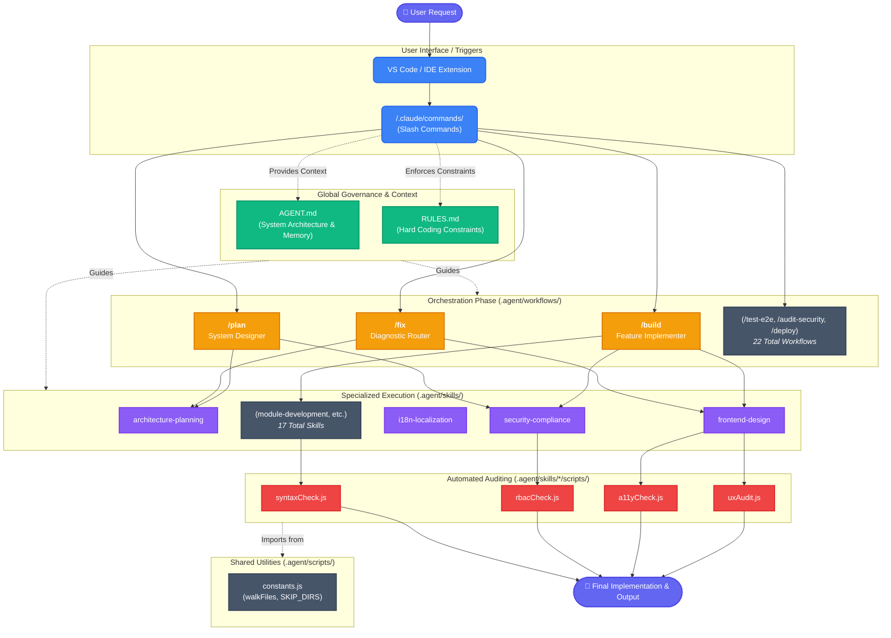

# AI Agent Architecture Flow

This flowchart illustrates the core routing, governance, and operational hierarchy of the enterprise-grade AI agent system implemented in the `.agent/` directory.

## How It Works

1. **Trigger (UI Layer):** The user triggers the agent using a specific natural language instruction or through a slash command in their IDE interface (e.g., `/build a new dashboard module`).
2. **Context Intake (Governance):** The AI universally loads `AGENT.md` to understand context and `RULES.md` to know the absolute constraints before processing anything.
3. **Orchestration (Workflows/Verbs):** The request routes into `.agent/workflows/` which acts as the high-level orchestrator. The AI identifies the goal, constructs an overarching plan, and establishes an approval gate for the user.
4. **Specialization (Skills/Nouns):** The workflow delegates complex tasks to specialized capabilities found in `.agent/skills/`. For example, visual modifications trigger the `frontend-design` skill to ensure cognitive load rules and contrast ratios are met.
5. **Validation (Scripts):** Before completing the implementation, the AI references built-in auditing scripts (like `uxAudit.js` or `rbacCheck.js`) to guarantee enterprise-grade quality and catch regressions.
   - **Shared Utilities Layer:** To DRY up script logic, auditing scripts import shared configuration from `.agent/scripts/constants.js` (e.g., standard directories to ignore, standardized file walking).
6. **Execution (Output):** Verified code and artifacts are returned to the user.
