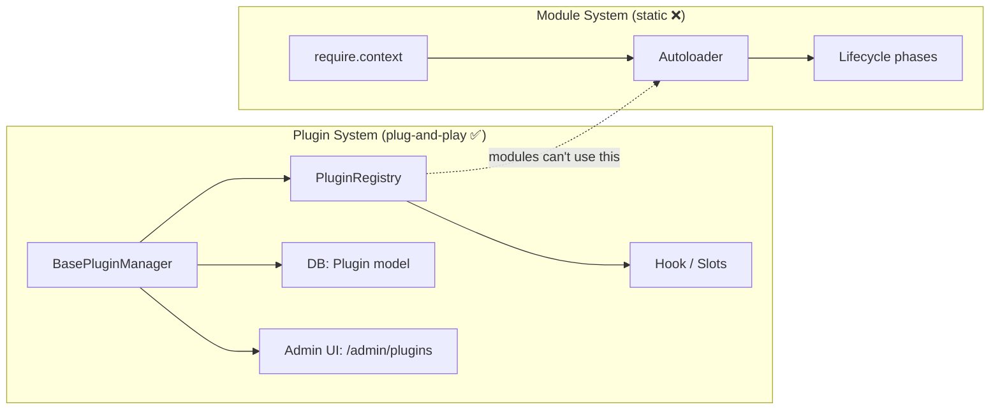
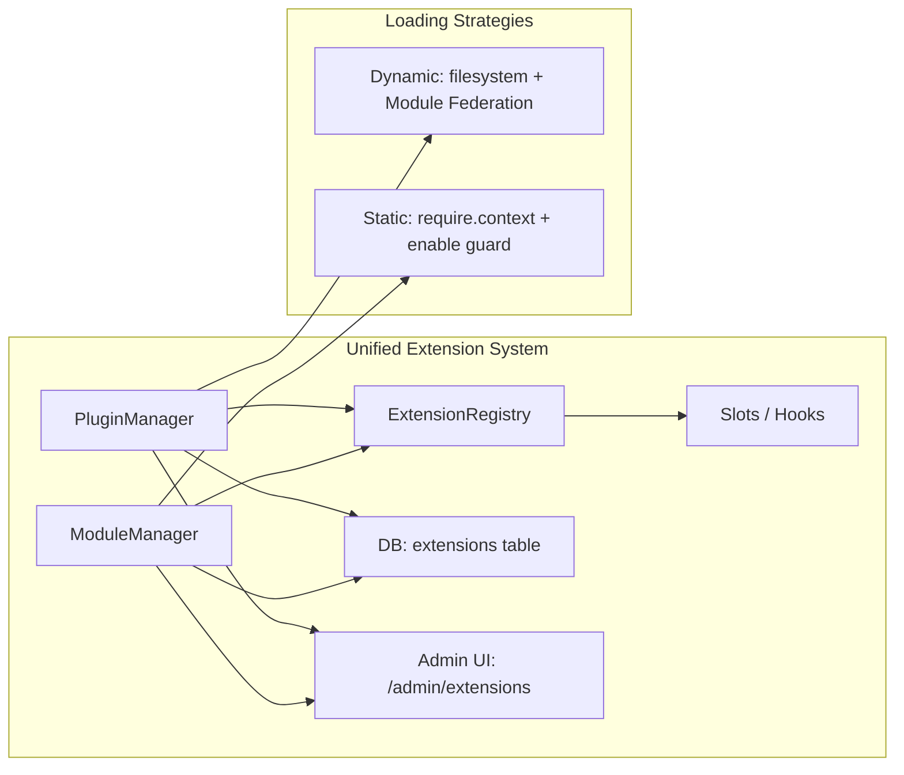

# Module Plug-and-Play — Combined with Plugin Infrastructure

## The Idea

Instead of building a separate `shared/module/` infrastructure, **reuse the existing plugin system** ([PluginRegistry](file:///Users/xuanguyen/Workspaces/react-starter-kit/shared/plugin/utils/Registry.js#26-476), [Hook](file:///Users/xuanguyen/Workspaces/react-starter-kit/shared/plugin/utils/Registry.js#401-409), slots, namespaces) for modules too. The core insight:

> The [PluginRegistry](file:///Users/xuanguyen/Workspaces/react-starter-kit/shared/plugin/utils/Registry.js#26-476) is already generic — it manages **slots**, **hooks**, **namespaces**, and **lifecycle** (init/destroy). None of this is plugin-specific. Modules can register as first-class citizens in the same Registry.

---

## Current Architecture



## Proposed: Unified Extension Registry



---

## What Changes

### 1. Rename [PluginRegistry](file:///Users/xuanguyen/Workspaces/react-starter-kit/shared/plugin/utils/Registry.js#26-476) → `ExtensionRegistry` (or keep as-is)

The [PluginRegistry](file:///Users/xuanguyen/Workspaces/react-starter-kit/shared/plugin/utils/Registry.js#26-476) in [Registry.js](file:///Users/xuanguyen/Workspaces/react-starter-kit/shared/plugin/utils/Registry.js) already supports everything modules need. Two options:

| Option | Pros | Cons |
|---|---|---|
| **A. Rename** to `ExtensionRegistry` | Semantically correct, clear intent | Breaking change in existing code |
| **B. Keep name, add `type` field** | Zero breaking changes, fast | Name is misleading |

> [!TIP]
> **Recommend Option B** — keep [PluginRegistry](file:///Users/xuanguyen/Workspaces/react-starter-kit/shared/plugin/utils/Registry.js#26-476) name, add a `type` discriminator (`'plugin'` vs `'module'`) to definitions and DB records.

### 2. Extend the DB Model

Add a `type` column to the existing [Plugin](file:///Users/xuanguyen/Workspaces/react-starter-kit/shared/plugin/utils/BasePluginManager.js#866-874) model (or create a unified `Extension` table):

```diff
 // Plugin model → Extension model
 {
   id: UUID,
   name: String,
   key: String,
+  type: ENUM('plugin', 'module'),  // discriminator
   version: String,
   status: ENUM('active', 'inactive', 'error'),
   config: JSON,
   checksum: String,
+  isCore: BOOLEAN,                  // core modules can't be disabled
 }
```

Core modules (`users`, `auth`, `permissions`, etc.) get `isCore: true` and cannot be disabled.

### 3. Modify Autoloaders — Register with Registry

In the API autoloader's [init](file:///Users/xuanguyen/Workspaces/react-starter-kit/shared/plugin/utils/BasePluginManager.js#89-133) phase, each module registers with the same [PluginRegistry](file:///Users/xuanguyen/Workspaces/react-starter-kit/shared/plugin/utils/Registry.js#26-476):

```diff
 // shared/api/autoloader.js — Phase 6: init
 errors.push(
   ...(await runPhase('init', lifecycles, (name, hook) => {
+    // Register module with the shared Registry for slot/hook interop
+    registry.register(`module:${name}`, {
+      name,
+      type: 'module',
+      init: () => hook(container),
+      destroy: () => {},
+    });
     hook(container);
   })),
 );
```

### 4. Add Enable/Disable Guard in Autoloaders

Before running lifecycle phases, check the DB for module status:

```javascript
// New helper in shared/api/autoloader.js
async function filterEnabledModules(paths, container) {
  const db = container.resolve('db');
  if (!db) return paths; // No DB = enable all

  // Query extension table for disabled modules
  const Extension = container.resolve('models')?.Extension;
  if (!Extension) return paths; // Table not yet created

  const disabled = await Extension.findAll({
    where: { type: 'module', status: 'inactive' },
    attributes: ['key'],
  });
  const disabledSet = new Set(disabled.map(d => d.key));

  return paths.filter(p => {
    const name = getModuleName(p);
    // Core modules are always enabled
    if (CORE_MODULES.has(name)) return true;
    return !disabledSet.has(name);
  });
}
```

### 5. Extend Admin UI

The existing Plugins admin page at `/admin/plugins` can be extended to show both types:

- **Tab: Plugins** — existing functionality (install, upload, activate)
- **Tab: Modules** — shows discovered modules with enable/disable toggle

Or create a unified `/admin/extensions` page.

### 6. Extend API Routes

```
GET    /api/extensions              → List all (plugins + modules)
GET    /api/extensions?type=module  → List modules only
PATCH  /api/extensions/:id/status   → Enable/disable (unified)
```

---

## How Modules Join the Registry

Modules already have lifecycle hooks. The key bridge is during the [init()](file:///Users/xuanguyen/Workspaces/react-starter-kit/shared/plugin/utils/BasePluginManager.js#89-133) phase:

```
┌─────────────────────────────────────────────────┐
│            Module Bootstrap (existing)           │
│                                                  │
│  translations → models → providers → migrations  │
│  → seeds → init → routes                        │
│                                                  │
│            ↓ During init() ↓                     │
│                                                  │
│  ┌──────────────────────────────────────────┐    │
│  │ registry.registerHook('module:users', …) │    │
│  │ registry.registerSlot('sidebar', …)      │    │
│  │ Container bindings via providers()       │    │
│  └──────────────────────────────────────────┘    │
└─────────────────────────────────────────────────┘
```

This means:
- **Plugins** can hook into **module** extension points
- **Modules** can hook into **plugin** extension points
- Both share the same [PluginRegistry](file:///Users/xuanguyen/Workspaces/react-starter-kit/shared/plugin/utils/Registry.js#26-476) singleton

---

## Implementation Order

1. **Add `type`/`isCore` columns** to the Plugin DB model (migration)
2. **Seed module records** — auto-register discovered modules in the DB during first boot
3. **Add `filterEnabledModules`** to both API and View autoloaders
4. **Register modules with Registry** during [init()](file:///Users/xuanguyen/Workspaces/react-starter-kit/shared/plugin/utils/BasePluginManager.js#89-133) phase
5. **Extend API** — add `/api/extensions` endpoints (or extend `/api/plugins` with `?type=module`)
6. **Extend Admin UI** — add Modules tab to plugins management page

> [!IMPORTANT]
> A server restart is required after enabling/disabling a module (modules are statically bundled). This is different from plugins which can hot-swap at runtime.

---

## Summary

| Aspect | Approach |
|---|---|
| **Infrastructure** | Reuse [PluginRegistry](file:///Users/xuanguyen/Workspaces/react-starter-kit/shared/plugin/utils/Registry.js#26-476), [Hook](file:///Users/xuanguyen/Workspaces/react-starter-kit/shared/plugin/utils/Registry.js#401-409), [BasePluginManager](file:///Users/xuanguyen/Workspaces/react-starter-kit/shared/plugin/utils/BasePluginManager.js#51-1128) |
| **DB** | Extend [Plugin](file:///Users/xuanguyen/Workspaces/react-starter-kit/shared/plugin/utils/BasePluginManager.js#866-874) model with `type` discriminator |
| **Loading** | Modules stay static (require.context), add enable guard |
| **Interop** | Modules register hooks/slots in the same Registry |
| **Admin** | Extend existing plugins UI with module management |
| **Core protection** | `isCore: true` prevents disabling essential modules |
