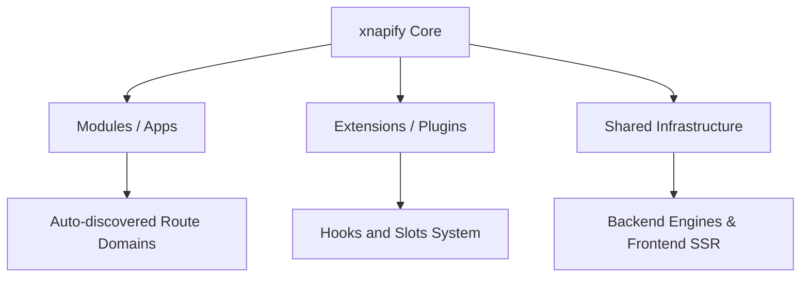

# Architecture Overview

The **xnapify** platform is an SSR-ready, full-stack React framework built on top of Express and Webpack. Its design philosophy optimizes for a completely modular separation of concerns. The entire project maps into three major top-level architectural paradigms:

1. **Modules** (`src/apps/`)
2. **Extensions** (`src/extensions/`)
3. **Shared Infrastructure** (`shared/`)

This document serves as your gateway to understanding these paradigms and how xnapify connects them.



---

## 1. Modules (`src/apps/`)

Modules (also called Apps or Domains) are the core building blocks for primary business data. They establish domain models, expose APIs, control administrative interfaces, and define their own database tables.

**Key behaviors of Modules:**
- **Auto-Discovery:** They are discovered instantly at startup by `shared/api/autoloader.js` (backend) and `shared/renderer/index.js` (frontend). No manual registration arrays exist.
- **Self-Contained Routing:** (e.g., URL `/users` maps exactly to `src/apps/users/views/(default)/_route.js`).
- **Rigid Definitions:** Encompasses Data (Sequelize models), Business logic (Services), and Visuals (React Components).

To deep-dive into creating Modules and understanding how Auto-Discovery works, see [Module Architecture](/docs/03-architecture-modules).

---

## 2. Extensions (`src/extensions/`)

Extensions are lighter, more decoupled plugin structures designed explicitly to hook into and adapt existing Modules **without** touching the original Module's code.

**Key behaviors of Extensions:**
- **Hooks:** Allow functional side-effects to happen in backend processes asynchronously. If a user is deleted in `src/apps/users`, the `src/extensions/activity-logs` can listen to `hook('users').on('deleted')` and record it.
- **Slots:** Allow UI components to visually inject themselves into generic layouts. A module rendering `<ExtensionSlot name="user-profile.header" />` can have numerous extensions append buttons without requiring hardcoded imports.

To deep-dive into creating Hooks and Slots safely, see [Extension Architecture](/docs/08-architecture-extensions).

---

## 3. Shared Infrastructure (`shared/`)

The Shared directories manage all the underlying engine-level tooling, global routing, and fundamental server logic that the Apps and Extensions depend on.

**Key components:**
- **Backend Engines (`shared/api/engines/`):** Manages dynamic connection routing (preboot), scheduling daemons, the embedded Database instances (SQLite, MySQL, Postgres), email queueing, background Node-RED workers, and WebSockets.
  - See [Backend Engines Architecture](/docs/05-architecture-backend)
  
- **Frontend Server-Side Rendering (`shared/renderer/`):** A rigid Webpack SSR pipeline that correctly passes data into the initial DOM string, manages hydrate-state mismatches, assembles Redux slice hierarchies automatically from module definitions, and orchestrates client `getInitialProps` calls.
  - See [Frontend React Architecture](/docs/06-architecture-frontend)

---

## Technical Paradigms

### Dependency Injection (The Container)

Modules and Extensions interact closely using the `container`. Throughout xnapify, files don't static-import each other linearly. Instead, services bind themselves to a `container` which is then passed around to all subsequent initializations.

```javascript
// Resolving dependencies globally
async boot({ container }) {
    const database = container.resolve('db')
    const queueDispatcher = container.resolve('queue')
    const myModuleService = container.resolve('users:service')
}
```

> [!NOTE]
> Utilizing Dependency Injection guarantees that tests can cleanly substitute mock implementations for engines by providing a mock `container`.

### Route-Level Discovery 

Instead of configuring a monumental `react-router` nested routing tree context manually, the project infers explicit nested structure entirely off system paths. A component structured in `views/marketing/landing/_route.js` constructs the exact path `[URL]/marketing/landing`, simplifying organizational load dynamically.

To understand the full data flow from URL to rendered component, see [Routing & Data Flow](/docs/04-architecture-routing).
