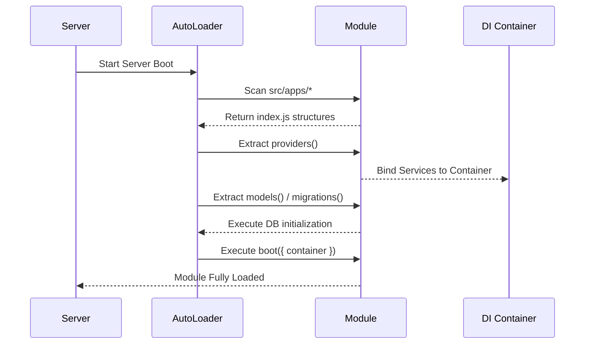

# Module Architecture

The `xnapify` application handles business logic via modular domains housed directly within the `src/apps/` directory. Each module provides clear separation of backend logic and frontend presentation while being automatically discovered without explicit registration in core application files.

---

## Directory Structure

Every domain typically splits into two main directories: `api/` and `views/`.

```text
src/apps/[module_name]/
├── api/                        # Backend Application Logic
│   ├── controllers/            # HTTP Request Handlers
│   ├── database/               # Database specific logic
│   │   ├── migrations/         # Auto-executed setup scripts
│   │   └── seeds/              # Auto-executed bootstrap scripts
│   ├── models/                 # Sequelize ORM Definitions
│   ├── routes/                 # Express routing
│   ├── services/               # Reusable business logic
│   ├── workers/                # Background job processors
│   └── index.js                # The Backend Module Entry Point
└── views/                      # Frontend Application Logic
    ├── components/             # React visual components
    ├── hooks/                  # Custom React hooks
    ├── slices/                 # Redux Toolkit definitions
    ├── (admin)/                # Administrative views
    │   └── [folder]/
    │       └── _route.js       # Auto-discovered Frontend Route
    └── index.js                # The Frontend Module Entry Point
```

---

## Module Export Signatures

Modules interact directly with the framework orchestrators through export signatures defined in their `index.js` files.

### Backend Entry Point (`api/index.js`)

The `api/index.js` must export a default object detailing instructions for the `shared/api/autoloader.js` across the application lifecycle.

```javascript
export default {
  // Binds modules, singletons, or factories to the DI container.
  providers({ container }) {
    // ...
  },

  // Declaratively registers contexts for auto-discovery using `import.meta.webpackContext()`
  translations: () => [
    import.meta.webpackContext('./translations', {
      recursive: true,
      regExp: /\.json$/,
    }),
  ],
  migrations: () =>
    import.meta.webpackContext('./database/migrations', {
      recursive: false,
      regExp: /\.js$/,
    }),
  models: () =>
    import.meta.webpackContext('./models', {
      recursive: false,
      regExp: /\.js$/,
    }),
  seeds: () =>
    import.meta.webpackContext('./database/seeds', {
      recursive: false,
      regExp: /\.js$/,
    }),

  // Registers HTTP endpoints
  routes: () =>
    import.meta.webpackContext('./routes', {
      recursive: true,
      regExp: /_route\.js$/,
    }),

  // Evaluated after models and providers have been setup.
  // Ideal for booting workers, cron tasks, websocket channels, or event queues.
  async boot({ container }) {
    const hook = container.resolve('hook');
    const schedule = container.resolve('schedule');

    // Perform startup routines
  },
};
```

### Frontend Entry Point (`views/index.js`)

Similar to the backend, the `views/index.js` manages frontend initialization logic executed by `shared/renderer/index.js`.

```javascript
export default {
  // Registers frontend specific locale contexts
  translations: () => [
    import.meta.webpackContext('./translations', {
      recursive: true,
      regExp: /\.json$/,
    }),
  ],

  // Binds cross-module frontend UI components to the frontend registry container
  providers({ container }) {
    // e.g. container.register('component:UserProfile', UserProfileComponent)
  },

  // Contributes this module's sidebar navigation. Views are chunked one per
  // route, so an entry registered from a route's `setup()` would not exist
  // until the reader had already navigated to the page it links to.
  menus({ store, i18n }) {
    // e.g. store.dispatch(registerMenu({ ns: 'admin', id: 'billing', ... }))
  },

  // Evaluated during react hydration and rendering startup
  async boot({ container }) {
    // Register custom hooks or UI startup mechanics here
  },

  // Declaratively identifies page routes. The context is declared
  // `mode: 'lazy'` (one chunk per view) and the hook returns
  // `[context, { lazy: true }]`. Every view module must agree — a bare context
  // here makes the merged adapter throw `MixedRouteLoadingStrategyError` at
  // boot and no route mounts at all.
  routes: () => [
    import.meta.webpackContext('.', {
      recursive: true,
      regExp: /_route\.js$/,
      mode: 'lazy',
    }),
    { lazy: true },
  ],
};
```

---

## Auto-Discovery Sequence

The following diagram illustrates how modules are discovered and bootstrapped when the xnapify server boots up.



---

## The Frontend `_route.js` Lifecycle

In xnapify, Frontend URLs are inferred directly from the file path where a `_route.js` file lives. Within this file, you can export explicit lifecycle hooks that handle Server Side Rendering (SSR), UI mounting, and authentication state.

| Export Hook                                              | Execution Timing            | Purpose                                                                                                                                                                                                                                                                                                                     |
| -------------------------------------------------------- | --------------------------- | --------------------------------------------------------------------------------------------------------------------------------------------------------------------------------------------------------------------------------------------------------------------------------------------------------------------------- |
| `export const middleware`                                | Before Route Entry          | Defines required permission guards (`requirePermission('read:users')`) or role guards.                                                                                                                                                                                                                                      |
| `export function init({ store })`                        | Application Bootstrap       | Dynamically injects the Redux Reducer into the global store tree.                                                                                                                                                                                                                                                           |
| `export function setup({ store, i18n })`                 | Route Evaluation            | Per-route registration that must be redone on every navigation. **Not for sidebar links** — a route's chunk is only fetched when that route is first matched, so a menu registered here is missing until the user has already been there. Module-wide navigation belongs in the module's `menus()` hook (`views/index.js`). |
| `export function teardown({ store })`                    | Route Cleanup               | Unregisters layout-level items or cleans memory.                                                                                                                                                                                                                                                                            |
| `export function mount({ store, i18n, path })`           | Component Mount execution   | Responsible for firing side-effects like generating breadcrumbs paths for the layout.                                                                                                                                                                                                                                       |
| `export function unmount({ store })`                     | Component Unmount execution | Route exit behaviors.                                                                                                                                                                                                                                                                                                       |
| `export async function getInitialProps({ fetch, i18n })` | SSR Resolution Pipeline     | Resolves page data prior to hydration. Data is placed on `context.initialProps` and passed to the Page and Layout components as a read-only prop. Runs server-side on first load, and client-side on subsequent navigations.                                                                                                |
| `export default Component`                               | Rendering                   | The actual React view rendered corresponding to the route path.                                                                                                                                                                                                                                                             |

---

## Best Practices

> [!WARNING]
> **Strict Isolation:** Avoid deep static `import/export` mapping across independent `apps/` domains. Rely instead on the **Dependency Injection (DI)** container `container.resolve()` capabilities or broadcasted hook events (`container.resolve('hook')('event-name')`).

> [!IMPORTANT]
> **Rspack Requirements:** Hooks such as `routes()`, `models()`, and `migrations()` MUST exactly return a `import.meta.webpackContext` evaluation — the bundler requires this literal compilation string to statically analyze files before bundling. A **view** module's `routes()` wraps it as `[context, { lazy: true }]`; everything else returns the context directly.

> [!NOTE]
> **Data Hydration:** Utilize `getInitialProps` on the frontend correctly to avoid cumulative layout impacts on screen load. By injecting states beforehand, React SSR will provide the finalized view HTML avoiding hydration mismatches.
