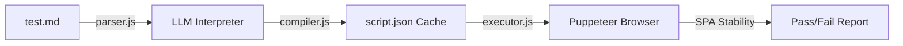

# E2E Test Automation

**xnapify** utilizes a unique AI-driven End-to-End (E2E) testing framework that transforms natural-language Markdown test cases into executable Puppeteer scripts. This compile-once, run-many approach allows non-engineers to contribute to test coverage without writing code, while maintaining the deterministic reliability of traditional automated suites.

---

## 1. The Architecture

The E2E framework operates across three distinct phases:

1. **Parsing:** Reads `test.md` files containing YAML front-matter, prerequisites, and plain English steps.
2. **Compilation (LLM Interpretation):** Transforms the plain English steps into a deterministic `script.json` cache using an LLM. This step happens **only once** per change to the test case.
3. **Execution:** Drives a headless Chrome instance via Puppeteer using the `script.json` instructions.



---

## 2. Setting Up Test Cases

Test type is auto-detected from the directory structure.

| Directory | Type | Speed | Browser Spawned? |
| --- | --- | --- | --- |
| `e2e/ui/{category}/{case}/` | UI Test | ~12s | Yes |
| `e2e/api/{category}/{case}/` | API Test | ~0.5s| No |

> [!TIP]
> Use **API Tests** for validating endpoints, auth flows, and RBAC rules because they are 25x faster than spinning up a full UI browser context.

### Example UI `test.md` format:

```markdown
---
email: admin@example.com
password: admin123
role: admin
---

# Quick Access Buttons Visible on Login Page

Verify that quick-access login buttons are rendered on the login page.

### Prerequisite
- fixture_zip: ./src/__tests__/fixtures/sample-extension.zip

## Steps
1. Navigate to the login page
2. Wait for the page to fully load
3. Verify the "Admin User" button is visible
4. Click the "Admin User" button

## Expected Results
- The login page loads without errors
- The user is logged in automatically
```

---

## 3. The SPA Stability Engine

A common pitfall in E2E testing React applications is arbitrary `sleep()` timers leading to flaky executions. xnapify utilizes an intelligent **SPA Stability Engine** that waits until the application fundamentally "settles" across 5 metrics prior to executing an action:

1. **Network** — No pending XHR/fetch requests.
2. **DOM** — No DOM mutations within a settle window.
3. **Animations** — No running CSS transitions on interactive elements.
4. **Loading UI** — No spinners, skeletons, or progress bars visible.
5. **React Internals** — No pending React Suspense boundaries.

By enforcing these constraints automatically, Puppeteer clicks elements exactly when they become interactive, drastically eliminating test flakiness.

---

## 4. Running the Tests

E2E tests are executed via the centralized `run` tool which automatically loads your `.env` variables prior to execution.

```bash
# Auto mode: compile if needed, then run all tests
npm run test:e2e

# Run with a visible browser (headed)
npm run test:e2e:headed

# Run tests scoped to a specific module
npm run test:e2e -- extensions
npm run test:e2e -- quick-access-plugin

# Filter tests by string or glob
npm run test:e2e -- --filter="**/login/**"
```

### Understanding the LLM Compilation

To prevent runaway API costs, the LLM is only utilized when writing or modifying tests. The generated `script.json` files have a SHA-256 hash mapped against the source markdown file. These JSON files **should be committed** to version control.

If a developer alters `test.md`, the hash mismatch triggers an LLM re-compilation locally. Pull requests in CI automatically run the committed `.json` instructions natively preventing external network requirements during continuous integration cycles.

---

## 5. Integrating with QA Teams (Excel Import)

QA Teams often write test cases in Excel spreadsheets. The framework ships with scripts to parse and scaffold these into the necessary `.md` structure.

```bash
# Generate black template with sample data mapping
npm run test:e2e:template

# Ingest an Excel spreadsheet and perform a dry run output preview
npm run test:e2e:import -- my-test-requirements.xlsx --dry-run
```
