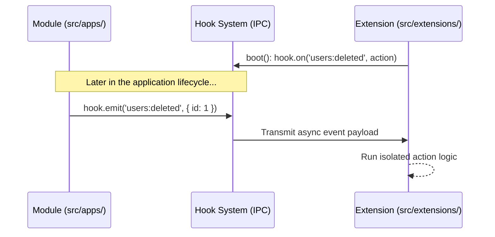

# Extensions Overview

Unlike Modules which construct the rigid core and fundamental database models of a domain, **Extensions** (`src/extensions/`) inject, transform, or adapt behaviors across the system purely via dependency-injected Hooks and Slots. Extensions can be toggled on/off dynamically during runtime via the Admin Panel Extension Manager without restarting the production Node.js service (though Hot-Module Reload manages this in dev).

---

## The Two Extension Archetypes

1. **Plugin-kind (No isolated View-routes)** 
   These do not export an exclusive `routes()` hook. Their entire frontend execution is dependent on hooking into existing module's UI slots or global Redux states.
2. **Module-kind (Contains isolated View-routes)** 
   Functions identically to Plugins but includes its own `routes()` exporter, thus registering isolated, fully addressable page layouts under a unique route prefix.

---

## Hook Activation Pipeline

Extensions have a distinct `activate` and `shutdown` pipeline. Extensions are registered declaratively.

### Core Export Signatures (`api/index.js` & `views/index.js`)

Extensions also export index objects, but they use hooks designed for transient interaction.

```javascript
/* src/extensions/my_extension/api/index.js */
export default {
    /* 
      Declarative Auto-Hooks
      Webpack statically builds these folders into module caches. 
      The system executes schemas/migrations on Extension installation automatically.
    */
    models: () => require.context('./models', false, /\.js$/),
    migrations: () => require.context('./database/migrations', false, /\.js$/),
    
    // Boot runs on Server Boot or Server toggling the extension ON
    boot({ container, registry }) {
        const hook = container.resolve('hook');
        
        // Listen to an application event
        hook('users').on('deleted', handleUserStatsCorrection);
        
        // Establish safe IPC bridge for the frontend extension UI
        registry.registerHook(
          `ipc:${__EXTENSION_ID__}:compute_score`, 
          registry.createPipeline(myComputationService), 
          __EXTENSION_ID__
        );
    },
    
    // Shutdown runs when the Server turns the extension OFF
    shutdown({ container, registry }) {
        const hook = container.resolve('hook');
        
        // CRITICAL DE-REGISTRATION
        hook('users').off('deleted', handleUserStatsCorrection);
        registry.unregisterHook(`ipc:${__EXTENSION_ID__}:compute_score`, __EXTENSION_ID__);
    }
}
```

> [!NOTE]
> `__EXTENSION_ID__` is a Webpack compile-time constant derived from the extension's **directory name** (e.g., `guides-module` for `src/extensions/guides-module/`). It can be overridden by setting `id` in the extension's database record.

---

## Extension Event Flow

The diagram below maps how an external module's hook triggers logic strictly maintained by decoupled extensions.



---

## UI Application (`views/index.js`)

In the frontend React environment, an extension usually registers Visual Components into **Slots**.

```javascript
/* src/extensions/my_extension/views/index.js */
import SettingsTab from './components/SettingsTab';

export default {
    boot({ registry }) {
         // This component will render precisely wherever the module 
         // declared `<ExtensionSlot name="user.profile.header" />`
         registry.registerSlot('user.profile.header', SpecializedRibbonComponent)
         
         // Injects meta-data for the admin dashboard settings tab
         registry.registerHook('settings.tabs.config', () => ({
             my_extension: {
                 label: "My Settings",
                 fieldOrder: ['API_KEY']
             }
         }))
    },
    
    shutdown({ registry }) {
         registry.unregisterSlot('user.profile.header', SpecializedRibbonComponent)
         registry.unregisterHook('settings.tabs.config')
    }
}
```

### What is an Extension Slot?

In the core `xnapify` Modules (e.g. `src/apps/users/views/components/Layout.js`), the module author can place empty extension anchors:
```javascript
import { ExtensionSlot } from '@shared/extension/ExtensionSlot'

export default function UserLayout({ user }) {
   return (
       <div>
           <h1>{user.name}</h1>
           {/* Extensions dynamically populate here */}
           <ExtensionSlot name="user.profile.header" props={{ user_id: user.id }} /> 
       </div>
   )
}
```
This paradigm ensures the `users` domain isn't crowded with static `import` commands from optional analytical or aesthetic extensions.

---

## Execution Requirements

> [!WARNING]
> **Strict De-Registration:** Extensions must un-register **everything** within their `shutdown` methods. Failure results in Memory-Leak crashes.

> [!CAUTION]
> **Immutability:** Do not mutate `src/apps/` files or the global DOM directly utilizing JavaScript (`document.getElementById()`). Confine all rendering strictly inside standard declarative component registration.
