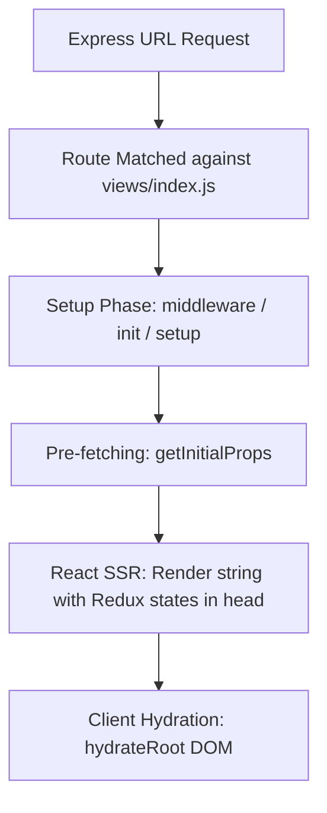

# Frontend & Server-Side Rendering (SSR) Architecture

The **xnapify** frontend relies heavily on a Universal Data fetching strategy bridged by **React**, **Redux Toolkit**, and **Webpack's SSR algorithms**. The entire frontend infrastructure is located in `shared/renderer/`, which orchestrates HTML string generation on Node instances and seamless DOM hydration once the payload impacts the user's browser.

---

## 1. The Rendering Lifecycle (React + Redux)

xnapify automatically maps Domain routing via URL path inference. When the Express Server encounters a route mapping to a Frontend view, the renderer triggers an evaluation sequence to bake the initial React tree.



### Core Render Sequence

1. **Routing Match**: Matches the user URL against `routes()` imported recursively by auto-discovery across `src/apps/*/views/index.js` and active extensions.
2. **Setup Phase (`setup` / `middleware`)**: 
   - Express runs the exported `middleware` checks array configured within `_route.js` (e.g., verifying user Authentication `requirePermission('admin:access')`).
   - `init({ store })` evaluates allowing components to securely inject Redux `slices`.
   - `setup({ store })` evaluates establishing the side-bar navigation states.
3. **Pre-fetching Phase (`getInitialProps`)**: 
   - Instead of empty loading screens, xnapify awaits the `getInitialProps` async exporter. Data returned here is injected into Redux directly.
4. **Server Side Render**: 
   - React translates the virtual DOM string injecting the Redux serialization payload directly onto the `<head>`.
5. **Client Hydration**: 
   - Upon arriving in the browser, `hydrateRoot` wraps the existing DOM minimizing cumulative layout shifts drastically.
   - `mount` lifecycle kicks off generating client-only behaviors.

---

## 2. Redux Slice Injection

To remain modular, reducers are injected lazily instead of bundling everything into one monolithic store initially. 

### Best Practices

> [!TIP]
> Instead of injecting in `views/index.js` (which evaluates continuously on server build), xnapify prescribes Redux Injection exactly when a route attempts to resolve (`_route.js`), saving massive scale performance.

```javascript
/* src/apps/marketing/views/_route.js */
import { injectReducer } from '@shared/renderer/store'
import marketingSlice from './slices/marketingSlice'
import PageLayout from './components/Page'

export function init({ store }) {
    store.injectReducer('marketing', marketingSlice)    
}

export default PageLayout
```

---

## 3. The Problem with React Portals & SSR

Using `client-side` mechanisms immediately triggers server hydration mismatches if they execute prior to mounting. Since React Portals `createPortal()` demand the `document` globally which the Server lacks, you must conditionally delay Portal rendering logic.

### SSR-Safe Portal Paradigm

```javascript
import React, { useState, useEffect } from 'react'
import { createPortal } from 'react-dom'

export default function SafeModal({ children }) {
    const [mounted, setMounted] = useState(false)
    
    useEffect(() => {
        setMounted(true)
    }, [])
    
    // Server simply ignores this preventing React 18 hydration crashes
    if (!mounted) return null;
    
    return createPortal(children, document.body)
}
```

---

## 4. Internationalization (i18n)

> [!CAUTION]
> Under NO circumstances does xnapify allow hardcoded interface strings. It integrates tightly with `i18next` localized statically and passed gracefully through Webpack context analysis.

Domains simply export a Webpack string analyzer inside their core index definitions:
```javascript
translations: () => require.context('./translations', true, /\.json$/)
```

Inside your React structure, utilize the standard `useTranslation` hooks:

```javascript
import { useTranslation } from 'react-i18next'

export default function MyButton() {
   const { t } = useTranslation() // automatically assumes standard route namespace
   return <button>{t('dashboard.submit')}</button>
}
```

---

## 5. Hot Module Reloading (HMR)

The `docker-compose.dev.yml` binds `volumes` straight to local file systems. Instead of completely rebooting Node.js, editing React files pipes Webpack updates transparently modifying the active DOM instantly minimizing state clearance. This requires extensions explicitly unregistering hooks using their `shutdown()` lifecycle mechanism; otherwise, memory leakage collapses the HMR pipe iteratively.
