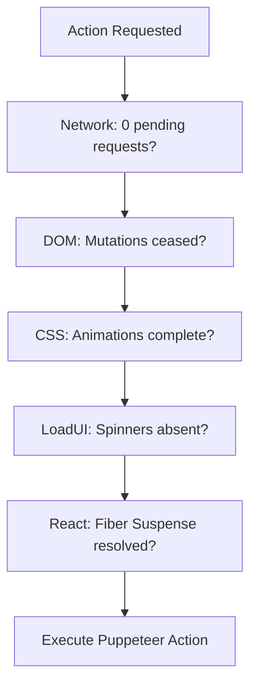

# Testing Architecture

The **xnapify** platform is tested through two distinct methodologies natively: 

1. **E2E Browser Automation** (`tools/e2e` utilizing Puppeteer)
2. **Automated Unit & Integration Tests** (utilizing Jest)

---

## 1. End-to-End (E2E) Browser Testing

xnapify integrates a powerful E2E framework built around **Puppeteer**. However, xnapify abstracts raw Puppeteer scripts behind an AI-interpreting SPA Stability Engine capable of reading markdown definitions and executing UI actions autonomously.

### The Compile-Then-Execute Flow

1. **Definition (`test.md`)**: A human writes test actions in English markdown.
2. **Compilation**: The internal CLI orchestrator passes the markdown document to an LLM compiler, converting steps into a deterministic `script.json` cache logic.
3. **Execution**: The JSON script is orchestrated against the live frontend application via a Puppeteer driver (`executor.js`).

### SPA Stability Engine

Modern React frontends frequently mutate asynchronously. Hardcoding `await page.waitForTimeout()` leads to flaky tests. The xnapify `executor.js` instead waits for comprehensive UI "Stability" across 5 metrics prior to executing a click or typing action.



### Pseudo-Selectors for Safe Targeting

> [!WARNING]
> Do not test by mapping brittle auto-generated CSS classes. Test via visible text outputs.

```javascript
// Test text natively:
await page.locator('::-p-text(Upload Extension)').click();
```

---

## 2. Unit and Integration Tests

For granular logic verification against isolated components (Sequelize database logic, Helper utilities, Backend Services), the framework utilizes **Jest**. 

### Test Hierarchy 
Jest tests frequently live directly alongside their implemented code counterpart ending with `.test.js`:

```text
src/apps/users/api/services/
├── UserActivationService.js
└── UserActivationService.test.js
```

### Best Practices

> [!NOTE]
> **Mocking Extraneous Engines**: Since Backend logic leans heavily on the DI `container`, integration tests inside xnapify should build mock Containers passing exclusively the explicitly needed engines allowing rapid test isolation.

> [!TIP]
> **In-Memory SQLite**: When testing `models()` and their respective persistence mechanics, leverage the SQLite engine dynamically overriding connections locally to avoid deploying tests into persistent DB stores.
