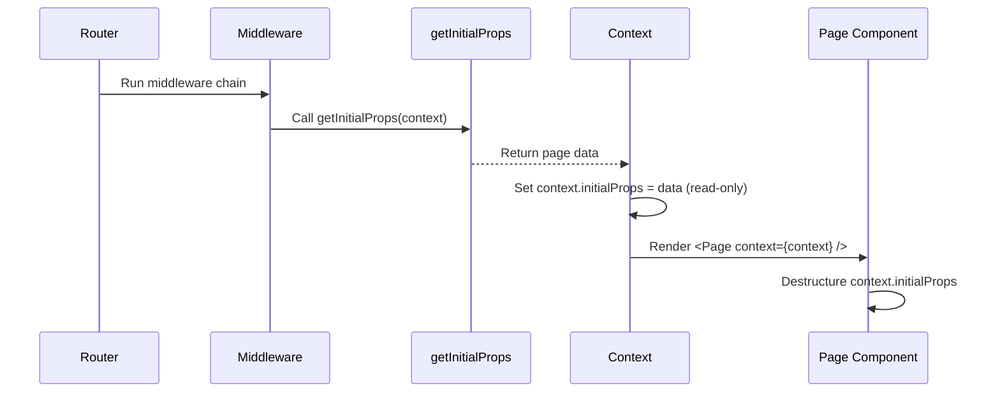

# Routing & Data Flow

The **xnapify** router manages the complete lifecycle of navigating between pages — from URL matching to data fetching to component rendering. This document covers the router's file-system-based route discovery, the `getInitialProps` data contract, and the layout composition pipeline.

---

## 1. File-System Route Discovery

Routes are inferred entirely from file paths. There is no central route configuration file. The router scans `views/` directories using Webpack's `require.context` and maps file paths to URL patterns.

### Path Mapping Rules

| File Path | URL Pattern | Notes |
|---|---|---|
| `views/(default)/_route.js` | `/` | `(default)` groups become root |
| `views/about/_route.js` | `/about` | Static segment |
| `views/users/[id]/_route.js` | `/users/:id` | Dynamic parameter |
| `views/docs/[...slug]/_route.js` | `/docs/:slug*` | Catch-all wildcard |
| `views/(admin)/dashboard/_route.js` | `/admin/dashboard` | Route groups unwrap parentheses |

For non-default modules (e.g., a module named `users`), the module name is auto-prefixed:
- `views/(admin)/[id]/edit/_route.js` → `/admin/users/:id/edit`
- `views/(default)/_route.js` → `/users`

---

## 2. The `getInitialProps` Data Contract

`getInitialProps` is the primary mechanism for loading page data during both Server-Side Rendering (SSR) and client-side navigation.

### How It Works



### The Context Object

Every page and layout component receives a single `context` prop containing:

| Property | Type | Description |
|---|---|---|
| `initialProps` | `Object` | Data returned by `getInitialProps` (read-only) |
| `params` | `Object` | URL parameters (e.g., `{ id: '42' }`) |
| `pathname` | `string` | Current URL path |
| `query` | `Object` | Query string parameters |
| `store` | `Object` | Redux store instance |
| `history` | `Object` | Navigation history (push, replace, go) |
| `locale` | `string` | Current i18n locale |
| `fetch` | `Function` | Isomorphic fetch scoped to the app's API |

### Accessing Data in Components

Page components access their data exclusively through `context.initialProps`:

```javascript
/* src/apps/my-app/views/profile/_route.js */

export async function getInitialProps({ fetch, params }) {
  const user = await fetch(`/api/users/${params.id}`);
  return { user, title: user.name };
}

export default function ProfilePage({ context: { initialProps } }) {
  const { user, title } = initialProps || {};
  return (
    <div>
      <h1>{title}</h1>
      <p>{user.email}</p>
    </div>
  );
}

ProfilePage.propTypes = {
  context: PropTypes.shape({
    initialProps: PropTypes.shape({
      user: PropTypes.object,
      title: PropTypes.string,
    }),
  }).isRequired,
};
```

> [!IMPORTANT]
> `context.initialProps` is the **single source of truth** for SSR-fetched data. Do not expect data to be spread as root component props — it is only available through the `context` object.

---

## 3. Layout Composition

Layouts wrap page components to provide shared UI structure (navigation, sidebars, footers). Layouts also receive the same `context` prop.

### Layout Types

1. **Theme Layouts** (`views/(layouts)/(default)/_layout.js`) — Global wrappers applied to all pages in a section
2. **Colocated Layouts** (`views/docs/_layout.js`) — Scoped to a specific route subtree

### Nesting Order

Layouts are applied from outermost to innermost:

```
Theme Layout → Colocated Layout → Page Component
```

```javascript
/* views/docs/_layout.js */
export default function DocsLayout({ children, context: { initialProps } }) {
  const tree = initialProps?.tree || [];
  return (
    <div className="layout">
      <Sidebar items={tree} />
      <main>{children}</main>
    </div>
  );
}
```

### Opting Out

A route can skip layouts entirely by exporting `layout = false`:

```javascript
export const layout = false;
export default function BarePageComponent() { /* ... */ }
```

---

## 4. Middleware & Guards

Routes can export middleware for authentication, permission checks, or redirects. Middleware runs **before** `getInitialProps`.

```javascript
/* Require admin access before loading data */
export const middleware = (context, next) => {
  const { store } = context;
  const user = store.getState().auth?.user;
  if (!user || !user.isAdmin) {
    return { redirect: '/login' };
  }
  return next();
};
```

### Redirect Pattern

Middleware can short-circuit the render pipeline by returning `{ redirect: '/path' }` without calling `next()`. The client router will navigate to the redirect path instead of rendering.

---

## 5. Resolve Result

When the router resolves a URL, it returns an object with:

| Property | Type | Description |
|---|---|---|
| `component` | `ReactElement` | The fully composed component tree (Page + Layouts) |
| `title` | `string` | Page title from `getInitialProps` (for `<title>` tag) |
| `redirect` | `string` | If present, client navigates here instead of rendering |
| `status` | `number` | HTTP status code (for SSR) |
| *...rest* | `any` | All other properties from `getInitialProps` are spread onto the result |

> [!NOTE]
> Properties like `title` from `getInitialProps` are available both on `context.initialProps.title` (inside the component) and on the resolve result (for the renderer's `<title>` side-effect). This dual availability is intentional — components read from `context`, the shell reads from the result.

---

## Best Practices

> [!TIP]
> **Keep `getInitialProps` fast.** It blocks rendering. Use `Promise.all` for parallel fetches and leverage the `cache` engine for repeated lookups.

> [!WARNING] 
> **Always provide defaults.** Destructure with fallbacks (`const { title } = initialProps || {}`) to prevent crashes when `getInitialProps` throws or returns partial data.

> [!CAUTION]
> **Never access `window` or `document` in `getInitialProps`.** It runs on the server during SSR. Use `useEffect` for browser-only operations.
